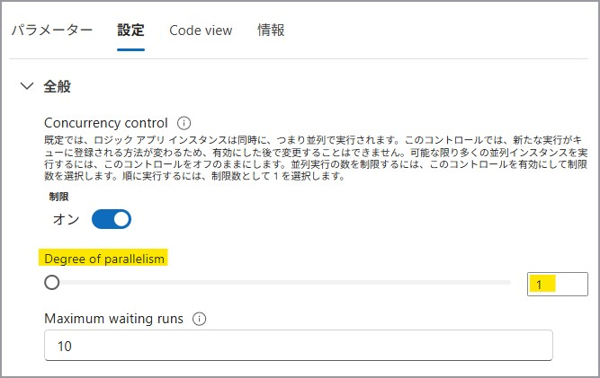
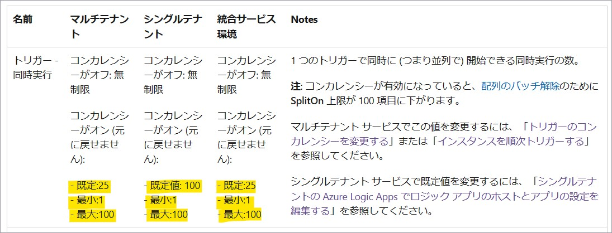
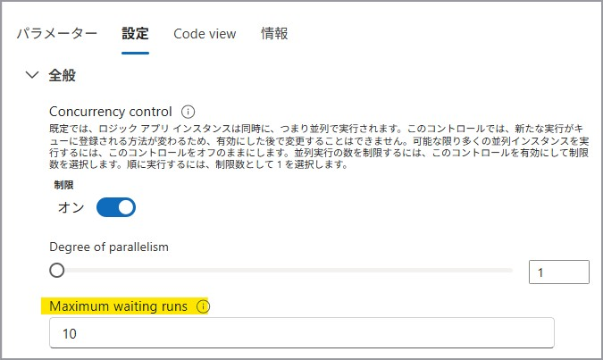
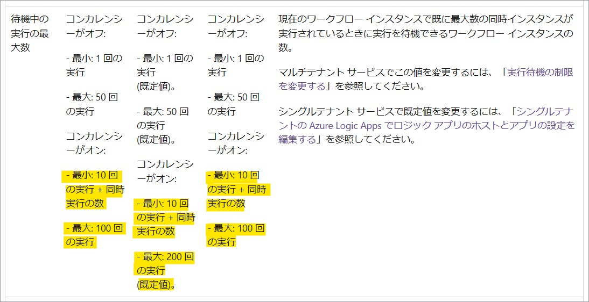
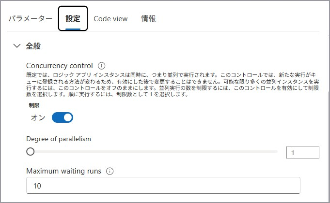
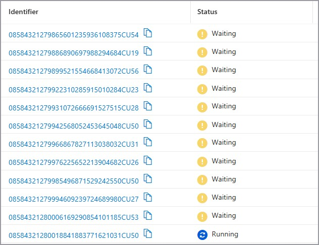
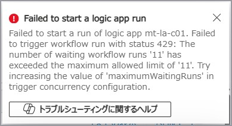

こんにちは。Azure Integration サポート チームの髙橋です。

トリガーに設定可能なコンカレンシー制御と最大実行待機数について説明します。

<!-- more -->

## こんな方におすすめです
- トリガーを順次実行とされたい方
- トリガーの並列実行数を制御されたい方

## 関連情報
- トリガーのコンカレンシー制御については、以下の公開情報がございます。
参考ドキュメント : [Azure Logic Apps の制約と構成の参考文献 # コンカレンシーと分割処理](https://learn.microsoft.com/ja-jp/azure/logic-apps/logic-apps-limits-and-config?tabs=consumption%2Cazure-portal#concurrency-and-debatching)

- トリガーのコンカレンシーを変更する方法については、以下の公開情報がございます。
参考ドキュメント : [Azure Logic Apps でのトリガーとアクションの種類のスキーマ リファレンス ガイド # トリガーのコンカレンシーを変更する](https://learn.microsoft.com/ja-jp/azure/logic-apps/logic-apps-workflow-actions-triggers#change-trigger-concurrency)

- トリガーの最大実行待機数を設定する方法については、以下の公開情報がございます。
参考ドキュメント : [Azure Logic Apps でのトリガーとアクションの種類のスキーマ リファレンス ガイド # 実行待機の制限を変更する](https://learn.microsoft.com/ja-jp/azure/logic-apps/logic-apps-workflow-actions-triggers#change-waiting-runs-limit)

## トリガーのデフォルト設定
従量課金タイプおよび Standard タイプの Logic Apps においては、デフォルトではコンカレンシー制御は「オフ」の状態であり、
トリガーが無制限に並列実行できる設定となっております。


## コンカレンシー制御の変更
トリガーの設定にて、コンカレンシー制御を「オン」とし、並列実行する数を制御することが可能です。
**一度コンカレンシー制御を「オン」としますと、元に戻すことができかねますのでご注意ください。**

以下の例では [When an HTTP request is received] トリガーを利用しております。
[設定] タブを開き、[Concurrency control] を [オン] とします。


[Degree of parallelism (並列処理の次数)] にて並列して起動するトリガーの数を制御することが可能です。
以下の例では、順次実行とするために [1] としております。


[Degree of parallelism (並列処理の次数)] には 1 ～ 100 をご設定いただけます。

参考ドキュメント : [Azure Logic Apps の制約と構成の参考文献 # コンカレンシーと分割処理](https://learn.microsoft.com/ja-jp/azure/logic-apps/logic-apps-limits-and-config?tabs=consumption%2Cazure-portal#concurrency-and-debatching)

## 最大実行待機数の設定
トリガーのコンカレンシー制御にて [Degree of parallelism (並列処理の次数)] で設定した値の数だけ並列処理が既に行われていて、
さらに新しいリクエストがトリガーに送られた場合には、先の処理が終わるまで待機させることが可能です。
このときの待機させる数 [Maximum waiting runs] をご設定いただけます。


[Maximum waiting runs] には 10 ~ 100 をご設定いただけます。

参考ドキュメント : [Azure Logic Apps の制約と構成の参考文献 # コンカレンシーと分割処理](https://learn.microsoft.com/ja-jp/azure/logic-apps/logic-apps-limits-and-config?tabs=consumption%2Cazure-portal#concurrency-and-debatching)

## 動作確認
たとえば以下のような設定をした場合についての動作を説明いたします。
[Degree of parallelism (並列処理の次数)] に [1]、[Maximum waiting runs] には [10] を設定しているため、順次実行され最大 11 の実行 (10 回の実行 + 同時実行の数) が待機する想定です。


まず一つ目の処理の実行を開始します。


一つ目の処理が実行されている間に、新しくトリガーを起動しますと以下のように 11 件 (10 回の実行 + 同時実行の数) まで待機いたします。


最大実行待機数を超えてトリガーを起動しようとしますと、以下のようにエラーが発生いたします。


トリガーを外部から呼び出す場合、呼び出し元には 429 (Too Many Requests) が返却され、呼び出しに失敗いたします。
この場合、Logic Apps 側の「トリガーの履歴」にも残りませんので、クライアント側にて時間を空けて再試行する等のご対応が必要となります。
```json
{
    "error": {
        "code": "WorkflowMaximumWaitingRunCountExceeded",
        "message": "The number of waiting workflow runs '11' has exceeded the maximum allowed limit of '11'. Try increasing the value of 'maximumWaitingRuns' in trigger concurrency configuration."
    }
}
```

## まとめ
本記事では、トリガーのコンカレンシー制御の設定方法、最大実行待機数についてご案内いたしました。
本記事が少しでもお役に立ちましたら幸いです。