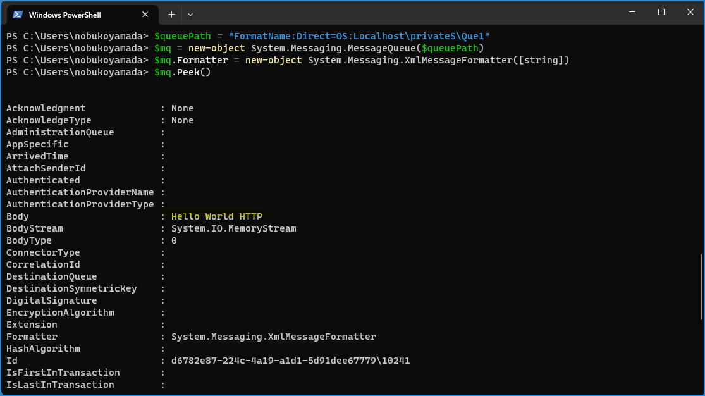

こんにちは！Azure Integration サポート チームの 山田 です。  
Azure Integration サポート チームでは Azure 製品以外にもオンプレミス製品を取り扱っております。今回は Windows に含まれる MSMQ というサービスについて、有効化する手順、コマンドから有効化されているかを確認する手順、サンプルを用いたメッセージを送受信する手順についてご紹介します。

<!-- more -->

## 目次
- MSMQ について
- MSMQ をインストール (有効化) する
- MSMQ が有効化されているか確認する
- メッセージを送信する
- メッセージを受信する 
- まとめ

## MSMQ について

MSMQ とは、弊社が提供するオンプレミス製品のメッセージ キューイング サービスです。
- [Message Queuing (MSMQ)](https://docs.microsoft.com/en-us/previous-versions/windows/desktop/legacy/ms711472(v=vs.85))

> Message Queuing (MSMQ) technology enables applications running at different times to communicate across heterogeneous networks and systems that may be temporarily offline. Applications send messages to queues and read messages from queues. 

> (翻訳) メッセージ キューイング（MSMQ）技術は、異なる時間に実行されるアプリケーションが、異種ネットワークや一時的にオフラインになる可能性のあるシステム間で通信することを可能にします。アプリケーションはキューにメッセージを送信し、キューからメッセージを読み取ります。

[MSMQ をドメイン モードでインストールする手順について | Japan Azure Integration Support Blog](https://jpazinteg.github.io/blog/MSMQ/MsmqCleanInstall/) にもご案内がございます。


## MSMQ をインストール (有効化) する

MSMQ のインストールに関する公開情報については以下に記載があります。
- [メッセージ キュー (MSMQ) のインストール](https://docs.microsoft.com/ja-jp/dotnet/framework/wcf/samples/installing-message-queuing-msmq)
- [MSMQ をドメインモードでインストールする手順について | Japan Azure Integration Support Blog](https://jpazinteg.github.io/blog/MSMQ/MsmqCleanInstall/#MSMQ-%E3%82%92%E3%83%89%E3%83%A1%E3%82%A4%E3%83%B3%E3%83%A2%E3%83%BC%E3%83%89%E3%81%A7%E3%82%A4%E3%83%B3%E3%82%B9%E3%83%88%E3%83%BC%E3%83%AB%E3%81%99%E3%82%8B%E6%89%8B%E9%A0%86%E3%81%AB%E3%81%A4%E3%81%84%E3%81%A6)


## MSMQ が有効化されているか確認する


MSMQ が有効化されているかは、以下のコマンドよりご確認いただけます。

```
Dism /online /Get-FeatureInfo /FeatureName:MSMQ
```

また、サービスが起動しているかは、以下のコマンドよりご確認いただけます。 

```
sc query MSMQ
```

## メッセージを送信する

PowerShell にてメッセージを送信するサンプルです。

以下のようにキューを作成しておきます。


サンプル 1:
```
[System.Reflection.Assembly]::LoadWithPartialName("System.Messaging")
$queuePath = "FormatName:Direct=TCP:<送信先 コンピューター名>\private$\<キュー名>"
$mq = new-object System.Messaging.MessageQueue($queuePath)
$mq.Send("Hello World")
```
[HTTP サポート](https://jpazinteg.github.io/blog/MSMQ/MsmqCleanInstall/#MSMQ-%E3%82%92%E3%83%89%E3%83%A1%E3%82%A4%E3%83%B3%E3%83%A2%E3%83%BC%E3%83%89%E3%81%A7%E3%82%A4%E3%83%B3%E3%82%B9%E3%83%88%E3%83%BC%E3%83%AB%E3%81%99%E3%82%8B%E6%89%8B%E9%A0%86%E3%81%AB%E3%81%A4%E3%81%84%E3%81%A6) を有効化している場合は以下もご利用いただけます。

サンプル 2:
```
[System.Reflection.Assembly]::LoadWithPartialName("System.Messaging")
$queuePath = "FormatName:Direct=http://<送信先 コンピューター名>/msmq/private$/<キュー名>"
$mq = new-object System.Messaging.MessageQueue($queuePath)
$mq.Send("Hello World HTTP")
```


## メッセージを受信する

PowerShell にてメッセージを受信するサンプルです。

サンプル:
```
[System.Reflection.Assembly]::LoadWithPartialName("System.Messaging")
$queuePath = "FormatName:Direct=<プロトコル名>:<受信 コンピューター名>\private$\<キュー名>"
$mq = new-object System.Messaging.MessageQueue($queuePath)
$mq.Formatter = new-object System.Messaging.XmlMessageFormatter([string])
$mq.Peek()
```

以下のように受信できます。



一連の動作確認にて、MSMQ をご理解いただければと思います。


## まとめ

本記事では、以下についてご案内いたしました。

- MSMQ について
- MSMQ をインストール (有効化) する
- MSMQ が有効化されているか確認する
- メッセージを送信する
- メッセージを受信する 

オンプレミス製品 MSMQ のご理解の一助として、本記事が少しでもお役に立ちましたら幸いです。最後までお読みいただき、ありがとうございました！

