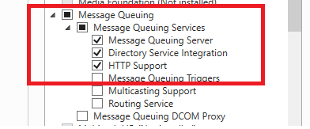
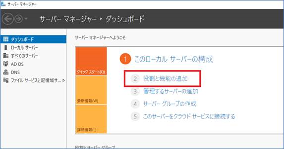
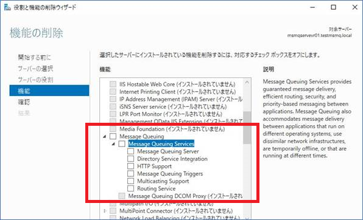
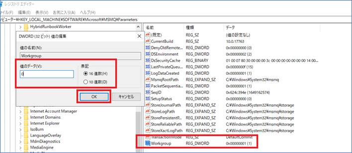
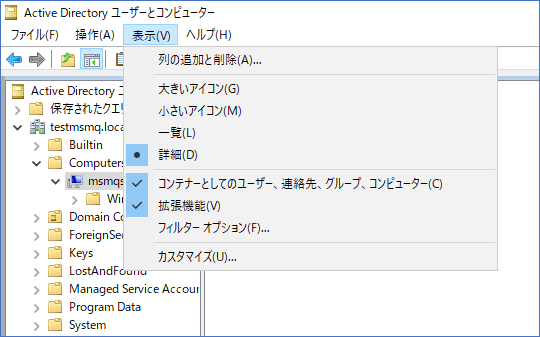
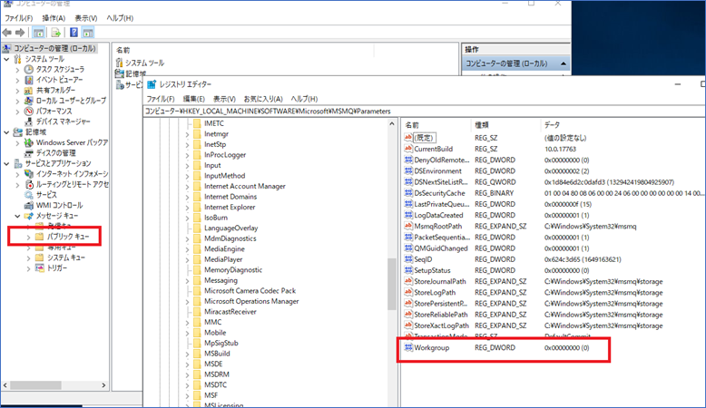

こんにちは！Azure Integration サポート チームの 川合 です。  
Azure Integration サポート チームでは Azure 製品以外にもオンプレミス製品を取り扱っておりますが、今回はその中でも MSMQ についてのご紹介と、ドメインモードでのインストール手順についてご紹介致します。

<!-- more -->

## 目次
- MSMQ について
- MSMQ をドメインモードでインストールする手順について
- ドメインモードのインストール失敗時の修正手順について
- まとめ

## MSMQ について
MSMQ とは、弊社が提供するオンプレミス製品のメッセージ キューイング サービスです。
- [Message Queuing (MSMQ)](https://docs.microsoft.com/en-us/previous-versions/windows/desktop/legacy/ms711472(v=vs.85))

通常のプログラムでは、実行中のプログラムはプログラム間のデータの送受信のタイミングを同期する必要があり、処理の開始・完了を待機する必要があります。
それに対してメッセージ キューイングでは、メッセージ ブローカーと呼ばれるソフトウェアがメッセージ キューと呼ばれるデータ保存領域に対してデータを管理し、データの送信側はデータの受信側の処理を待たなくてもデータをキューに書き出したタイミングで処理を完了させることができます。また、受信側も任意のタイミングでキューから取り出すことができ、非同期での処理が可能になります。

## MSMQ をドメインモードでインストールする手順について
MSMQ のインストールに関する公開情報については以下に記載がありますので、ご興味あります方はぜひご覧ください。
- [メッセージ キュー (MSMQ) のインストール](https://docs.microsoft.com/ja-jp/dotnet/framework/wcf/samples/installing-message-queuing-msmq)

公開情報には Windows Vista や Windows 7 等の記載がありますが、お使いの Windows 10 や Windows Server 2008 以降の Windows Server 製品であればご利用いただくことが可能です。
ドメインに参加せずに MSMQ をご利用になられたい場合は、以下のように設定いただくことでワークグループモードとしてご利用いただくことが可能です。

ドメインに参加して MSMQ をご利用になられたい場合、公開情報に記載のあります通り、
**[ディレクトリ サービス統合] をクリックし (ドメインに参加するコンピューターの場合)、 [HTTP サポート] をクリックします。**
のように、[ディレクトリ サービス統合 (Directory Services Integration) ]  と [HTTP サポート]  のチェックボックスにチェックを設定し、ドメインモードとしてインストールしてください。

この時、それ以外のチェックについてはお客様のご要件に合わせて必要な項目のみチェックいただく必要がございます。
マルチキャスティング サポートやルーティング サービスについては、以下の公開情報の通り Active Directory Domain Servicesで適切なアクセス許可設定が必要となります。

- [To grant permissions for a computer object to the Servers object in Active Directory Domain Services before installing the Routing Service feature on a computer that is not a domain controller](https://docs.microsoft.com/en-US/previous-versions/windows/it-pro/windows-server-2008-R2-and-2008/cc730960(v=ws.11)?redirectedfrom=MSDN#to-grant-permissions-for-a-computer-object-to-the-servers-object-in-active-directory-domain-services-before-installing-the-routing-service-feature-on-a-computer-that-is-not-a-domain-controller)

【翻訳】
ドメインコントローラーではない Windows Server 2008 R2 のコンピューターにルーティングサービス機能を、ドメインコントローラーである Windows Server 2008 R2 のコンピューターにメッセージキューイングのディレクトリサービス統合機能を正しくインストールするには、Active Directory Domain Servicesに特定のアクセス許可を設定することが必要です。これらの機能をインストールする前に、以下の手順に従ってActive Directory Domain Servicesで適切なアクセス許可を付与してください
※ここで Windows Server 2008 R2 といった記載がありますが他の OS に関しても同様です。

上記の設定をせずにマルチキャスティング サポートやルーティング サービスのチェックボックスに設定をしてインストールした場合、正しくインストール出来ない場合がございますのでご留意ください。

## ドメインモードのインストール失敗時の修正手順について
上記の公開情報を基にインストール作業を実施いただくことですぐに MSMQ をご利用いただくことが可能ですが、お客様の環境によってはインストール作業時にエラーになったり、ワークグループモードからドメインモードにインストールが出来ない場合がございます。どうしてもワークグループモードからドメインモードに変更できない場合、以下の操作を実施いただくことでドメインモードに切り替えることが出来ます。操作の実施にあたっては、レジストリの変更やサーバーの再起動を伴います。十分に作業計画を立て、事前に検証を実施したうえで実施をお願いいたします。

【修正手順】
1．MSMQ がインストールされているサーバーにログインし、サーバーマネージャーを起動する。

2．[役割と機能の追加]を選択する。
 

3．[役割と機能の削除ウィザードの起動] を選択する。
 

4．[Message Queuing] サービスについて全てチェックを外す。
 

5．アンインストールが完了したら [閉じる] を選択する。
 

※反映には再起動が必要となりますが、この時点では再起動はしません。

6．Windows キー + R キーを同時に押下し、[ファイル名を指定して実行] に “ regedit ” と入力して [OK] を選択。
 

7．以下のレジストリキーを確認し、 “Workgroup"=dword:00000001 の場合、値を0に変更する。

HKEY_LOCAL_MACHINE\SOFTWARE\Microsoft\MSMQ\Parameters
存在しない場合は手順の実施は不要。

 

8．ドメインコントローラーがインストールされているサーバーへログイン後、
[Active Directory ユーザーとコンピューター] を開き、[表示] を以下の設定にする。
 

9．MSMQ がインストールされているサーバーより、MSMQ オブジェクトを削除する。
存在しない場合は手順の実施は不要。

 

10．以上の作業が完了後、MSMQ がインストールされているサーバーの再起動を実施する。
ドメインコントローラーがインストールされているサーバーについては作業は不要。

11．MSMQ がインストールされているサーバーに再度ログインし、
[ディレクトリ サービス統合 (Directory Services Integration) ] を有効にしてMSMQサービスを再インストールする。 

12．インストール完了後、MSMQ がインストールされているサーバーの再起動を実施する。
ドメインコントローラーがインストールされているサーバーについては作業は不要。

＜作業結果確認＞
作業後に以下の内容になっていることを確認。
・コンピューターの管理にパブリックキューが表示されている。
・Workgroup の値が 0 になっている。

以上、 MSMQ をドメインモードでインストールする方法と、インストール失敗時の修正手順についてご紹介させていただきました。

## まとめ
本記事では、以下についてご案内いたしましたが、ご理解いただけましたでしょうか。
- MSMQ の概要
- MSMQ をドメインモードでインストールする方法とインストール失敗時の修正手順

本記事が少しでもお役に立ちましたら幸いです。最後までお読みいただき、ありがとうございました！

