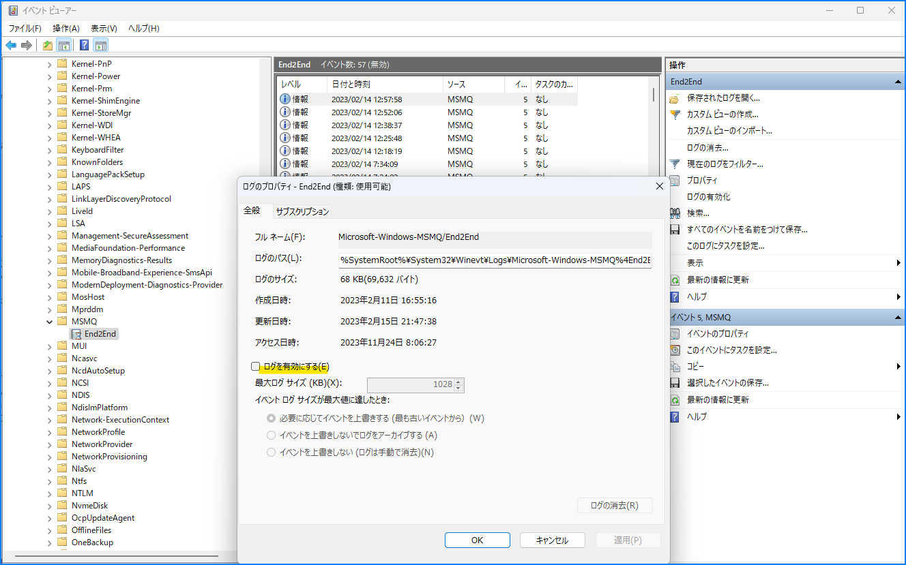
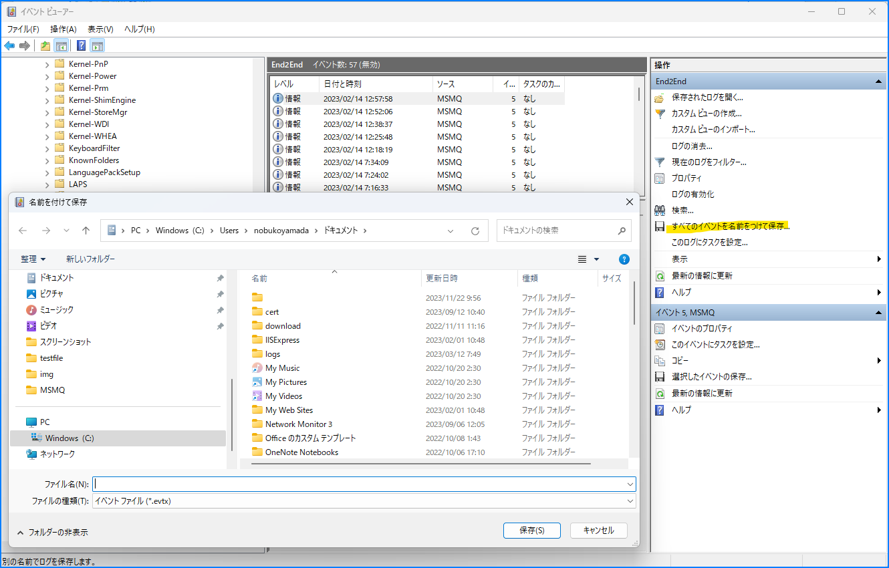
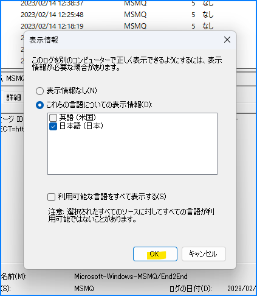

こんにちは！Azure Integration サポート チームの 山田 です。  
Azure Integration サポート チームでは Azure 製品以外にもオンプレミス製品を取り扱っております。今回は Windows に含まれる MSMQ というサービスにて、調査時に有用な End2End ログを有効化する手順、取得する手順についてご紹介します。

<!-- more -->

## 目次
- MSMQ について
- MSMQ の End2End ログを有効化する
- MSMQ の End2End ログを取得する
- まとめ

## MSMQ について

MSMQ とは、弊社が提供するオンプレミス製品のメッセージ キューイング サービスです。
- [Message Queuing (MSMQ)](https://docs.microsoft.com/en-us/previous-versions/windows/desktop/legacy/ms711472(v=vs.85))

> Message Queuing (MSMQ) technology enables applications running at different times to communicate across heterogeneous networks and systems that may be temporarily offline. Applications send messages to queues and read messages from queues. 

> (翻訳) メッセージ キューイング（MSMQ）技術は、異なる時間に実行されるアプリケーションが、異種ネットワークや一時的にオフラインになる可能性のあるシステム間で通信することを可能にします。アプリケーションはキューにメッセージを送信し、キューからメッセージを読み取ります。

- [MSMQ を有効化する手順・メッセージを送受信する手順 | Japan Azure Integration Support Blog](https://jpazinteg.github.io/blog/MSMQ/MsmqCheckInstall/)
- [MSMQ をドメイン モードでインストールする手順について | Japan Azure Integration Support Blog](https://jpazinteg.github.io/blog/MSMQ/MsmqCleanInstall/) 

上記にもご案内がございます。

## MSMQ の End2End ログを有効化する

End2End ログは [コンピューターの管理]-[システム ツール]-[アプリケーションとサービス ログ]-[Microsoft]-[Windows]-[MSMQ] から ご確認いただけます。

1. 対象の端末でイベント ビューアーを開きます。ショートカット キー「Windows + X」を押下後に「V」を押下しますと、「イベント ビューアー」が開きます。
2. 左側のメニューから [アプリケーションとサービス ログ]-[Microsoft]-[Windows]-[MSMQ] から End2End に移動します。
3. 画面右側の [操作] から [プロパティ] を選択します。
4. [ログを有効にする] にチェックを入れ、最大ログ サイズに 100MB 程度を入力し、[必要に応じてイベントを上書きする (最も古いイベントから)] にチェックを入れます。
5. [OK] を選択します。

以上にて End2End ログが有効化されます。

## MSMQ の End2End ログを取得する

続いて End2End ログ取得手順です。

1. 対象の端末でイベント ビューアーを開きます。ショートカット キー「Windows + X」を押下後に「V」を押下しますと、「イベント ビューアー」が開きます。
2. 左側のメニューから [アプリケーションとサービス ログ]-[Microsoft]-[Windows]-[MSMQ] から End2End に移動します。
3. 画面右側の [操作] から [すべてのイベントを名前を付けて保存] を選択します。
4. [ファイルの種類] が [*.evtx] であることを確認し、ファイルの出力先を指定し、任意のファイル名を入力し、[保存] を選択します。
5. [これらの言語についての表示情報] にチェックを入れ、表示情報に 日本語 または 英語 にチェックが入っていることを確認し、[OK] を選択します。

以上にて End2End ログを取得いただけます。

## まとめ

本記事では、以下についてご案内いたしました。

- MSMQ について
- MSMQ の End2End ログを有効化する
- MSMQ の End2End ログを取得する

End2End ログは既定で無効化状態となり、調査対象の事象発生時に End2End ログが有効でない場合、ログが収集できていない状況と想定されます。

オンプレミス製品 MSMQ についてもしもの時のご理解の一助として、本記事が少しでもお役に立ちましたら幸いです。最後までお読みいただき、ありがとうございました！

