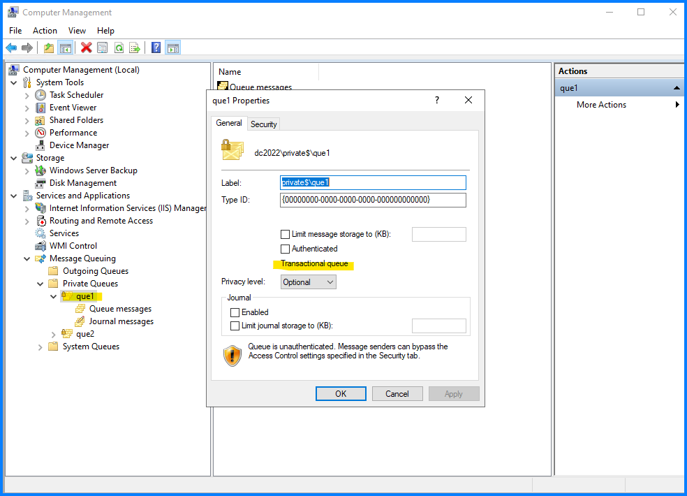

こんにちは！Azure Integration サポート チームの 山田 です。  
Azure Integration サポート チームでは Azure 製品以外にもオンプレミス製品を取り扱っております。今回は Windows に含まれる MSMQ というサービスのメッセージの種類についてご紹介します。

<!-- more -->

## 目次
- MSMQ について
- MSMQ のトランザクション メッセージ
- MSMQ のトランザクション メッセージ送信
- MSMQ のトランザクション メッセージ再試行
- まとめ

## MSMQ について

MSMQ とは、弊社が提供するオンプレミス製品のメッセージ キューイング サービスです。
- [Message Queuing (MSMQ)](https://docs.microsoft.com/en-us/previous-versions/windows/desktop/legacy/ms711472(v=vs.85))

> Message Queuing (MSMQ) technology enables applications running at different times to communicate across heterogeneous networks and systems that may be temporarily offline. Applications send messages to queues and read messages from queues. 

> (翻訳) メッセージ キューイング（MSMQ）技術は、異なる時間に実行されるアプリケーションが、異種ネットワークや一時的にオフラインになる可能性のあるシステム間で通信することを可能にします。アプリケーションはキューにメッセージを送信し、キューからメッセージを読み取ります。

- [MSMQ を有効化する手順・メッセージを送受信する手順 | Japan Azure Integration Support Blog](https://jpazinteg.github.io/blog/MSMQ/MsmqCheckInstall/)
- [MSMQ をドメイン モードでインストールする手順について | Japan Azure Integration Support Blog](https://jpazinteg.github.io/blog/MSMQ/MsmqCleanInstall/) 
- [MSMQ で End2End ログを取得する手順 | Japan Azure Integration Support Blog](https://jpazinteg.github.io/blog/MSMQ/MsmqEnd2Endlog/)

上記にも関連記事がございます。


## MSMQ のトランザクション メッセージ

トランザクション キュー で扱われるメッセージと非トランザクション キューで扱われるメッセージの違いについて、主にトランザクション キューでは「順序を保証する」点が特徴になります。

以下のようなドキュメントをご覧いただけます。

[WCF でのキュー - WCF | Microsoft Learn](https://learn.microsoft.com/ja-jp/dotnet/framework/wcf/feature-details/queuing-in-wcf#msmq)

> MSMQ では、キューをトランザクションまたは非トランザクションとして設定できます。
トランザクション キューの場合、トランザクションによるメッセージの取り込みと配信が可能です。

> メッセージは、キューに永続的に格納されます。トランザクション キューに送信されたメッセージは、正確に 1 回だけ、順序どおりに転送されます。 

> 非トランザクション キューを使用すると、揮発性メッセージと非揮発性メッセージの両方を送信できます。

> 非トランザクション キューに送信されたメッセージには、信頼できる転送保証がありません。したがって、メッセージが失われる可能性があります。

それぞれ以下から確認いただけます。

### トランザクション キュー


### 非トランザクション キュー


## MSMQ のトランザクション メッセージ送信

以下は、トランザクション キューに PowerShell にてメッセージを送信するサンプルです。

### トランザクション メッセージ送信コマンド例

```
[System.Reflection.Assembly]::LoadWithPartialName("System.Messaging")
$queuePath = "FormatName:Direct=OS:<送信先 コンピューター名>\private$\<キュー名>"
$mq = new-object System.Messaging.MessageQueue($queuePath)
$tran = new-object System.Messaging.MessageQueueTransaction;
$tran.Begin()
$mq.Send("Hello transaction 1", $tran)
$mq.Send("Hello transaction 2", $tran)
$tran.Commit()
```

### 非トランザクション メッセージ送信コマンド例

以下記事で非トランザクション キューに PowerShell にてメッセージを送信するサンプルを紹介しています。合わせてご覧ください。

[MSMQ を有効化する手順・メッセージを送受信する手順 | Japan Azure Integration Support Blog](https://jpazinteg.github.io/blog/MSMQ/MsmqCheckInstall/)


## MSMQ のトランザクション メッセージ再試行

コマンドの違いとしては上の通り、begin ～ commit にてメッセージを囲むことで「順序通りに送る」ことを保証できる点にありますが、内部的にも、トランザクション メッセージは以下のような振る舞いをいたします。

MSMQのトランザクション メッセージは、トランザクションの完了を確認するために内部の order_queue$ というキューを使用します。通常、トランザクションの order_queue$ への ack は、MSMQ クライアントが確立したのと同じ TCP セッションで送り返されます。

トランザクション メッセージを送信すると、受信したサーバーから送信元の order_queue$ へ返答を送り返していることが分かります。


一方、一般的なネットワーク・通信エラーやその他の問題が発生した場合、TCP セッションが切断される状況もあります。その場合、送信された返答は送信キューに入れられますが、MSMQ 送信メッセージの送信再試行ポリシーで再試行されます。

[SeqResend13Time | Microsoft Learn](https://learn.microsoft.com/ja-jp/previous-versions/windows/it-pro/windows-2000-server/cc957504(v=technet.10)?redirectedfrom=MSDN)

> Determines how often outgoing, transacted messages are resent because they are unacknowledged.
The value of this entry specifies the interval between resends for the first three times the message is resent. If, after the third resend, the sender still does not receive an acknowledgement from the intended recipient, the message is resent at intervals determined by the values of the following entries: SeqResend46Time , SeqResend79Time , SeqResend10Time

>(翻訳) 送信されたトランザクション・メッセージが再送される頻度を指定します。このエントリの値は、メッセージが再送される最初の3回の再送間隔を指定します。3回目の再送の後、送信者がまだ意図した受信者から確認応答を受け取らない場合、メッセージは以下のエントリの値で決まる間隔で再送されます： SeqResend46Time , SeqResend79Time , SeqResend10Time
 
既定では、MSMQ は以下の間隔でメッセージの再送信を試みます。

- SeqResend13Time:試行1-3 回:30秒:[SeqResend13Time | Microsoft Learn](https://learn.microsoft.com/en-us/previous-versions/windows/it-pro/windows-2000-server/cc957504(v=technet.10)?redirectedfrom=MSDN)
- SeqResend46Time:試行4-6 回:300秒(5分):[SeqResend46Time | Microsoft Learn](https://learn.microsoft.com/en-us/previous-versions/windows/it-pro/windows-2000-server/cc957505(v=technet.10)?redirectedfrom=MSDN)
- SeqResend79Time:試行7-9 回:1800秒(30分):[SeqResend79Time | Microsoft Learn](https://learn.microsoft.com/en-us/previous-versions/windows/it-pro/windows-2000-server/cc957506(v=technet.10)?redirectedfrom=MSDN)
- SeqResend10Time:試行10+ 回:21600秒(6時間):[SeqResend10Time | Microsoft Learn](https://learn.microsoft.com/en-us/previous-versions/windows/it-pro/windows-2000-server/cc957503(v=technet.10)?redirectedfrom=MSDN)

以上、参考になりましたら幸いです。

## まとめ

本記事では、以下についてご案内いたしました。

- MSMQ について
- MSMQ のトランザクション メッセージ
- MSMQ のトランザクション メッセージ送信
- MSMQ のトランザクション メッセージ再試行


トランザクション メッセージの活用と、オンプレミス製品 MSMQ についてご理解の一助として、本記事が少しでもお役に立ちましたら幸いです。最後までお読みいただき、ありがとうございました！

