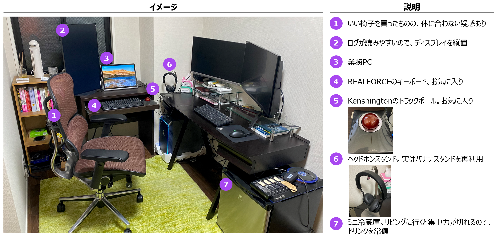
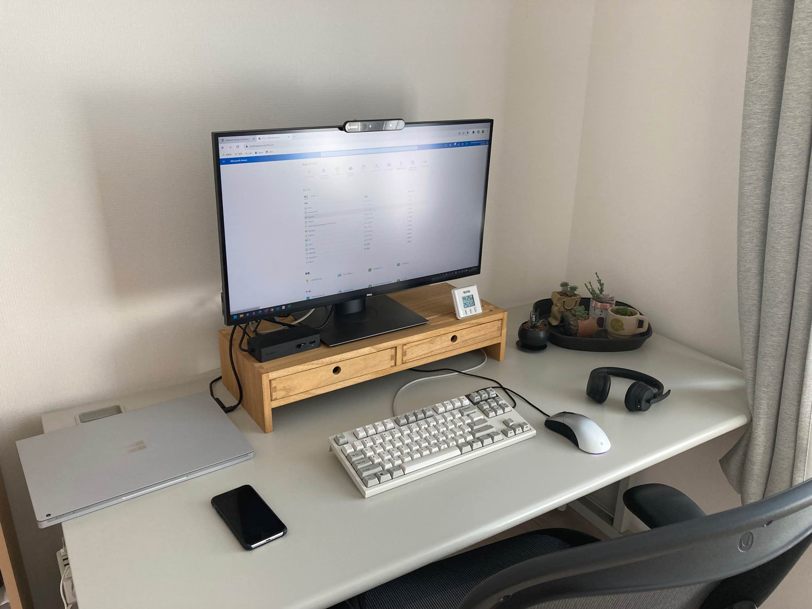
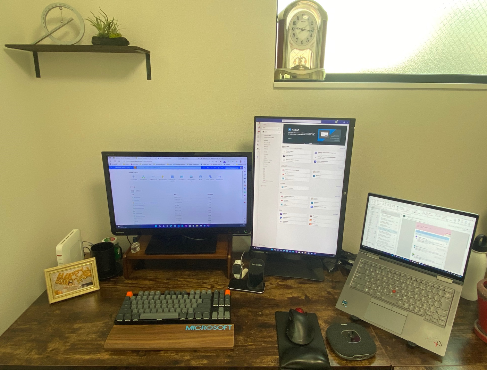

こんにちは。Azure Integration サポート チームの髙橋です。
今日は、私たちのチームがどのように働いているのか、少しでも皆さんにイメージしていただき、興味をもっていただけるよう、普段の働き方や仕事環境について紹介いたします。
<!-- more -->

## 目次
- [仕事の流れ](#仕事の流れ)
- [デスク ツアー！](#デスク-ツアー！)
- [仕事のやりがい](#仕事のやりがい)
- [サポート エンジニアだからこそ向上したスキル](#サポート-エンジニアだからこそ向上したスキル)
- [自動化の紹介](#自動化の紹介)

## 仕事の流れ
Microsoft のサポート エンジニアはお客様から起票いただいたサポート リクエストを通してお客様の抱える問題を解決するための技術支援を行います。
案件の受付からクローズまで基本的には担当するメンバーがオーナーシップを持って対応します。
基本的な案件対応の流れとしては、**案件の受付 → 調査方針の決定 → 発生している問題の調査 → 回答、事象の解消を確認 → クローズ**、です。
案件の受付から、概ね 14 日程度でクローズとなります。
各エンジニアは 10 ~ 20 件ほどの案件を担当として受け持ち、また同時並行で案件対応を進めていきます。

このように記載すると 1 つの案件を最初から最後まで自分ひとりで対応しなければいけないように感じるかもしれません。
しかし、実際には同じチームのメンバーや、その他の Azure サポート チームのメンバーと非常に密に連携しながら調査を進めています。
クラウド サービスでは、新しい機能の追加や機能の改修が日常的に行われており、もはや一人のスーパー エンジニアが何でも知っている、という時代ではなくなっています。
言い換えれば、新しい機能や未知の問題に直面したとき、あなたがその問題の第一人者です。
このような状況から、各案件でオーナーシップをとる担当者がいるものの、実際には色々なメンバーと支援をし合いながら調査を行っています。

次に、Azure Integration チームのサポート エンジニアのとある 1 日について紹介いたします！

### とある 1 日の流れ
**9:00 - サポート窓口が開きます。**
業務を開始！まずはメール チェックし、今日一日のタスクの洗い出し。
---
**9:30 - チームの朝会に参加します！**
チーム全体への共有事項の展開や、サポート案件対応で困ったポイントを相談します。
---
**10:00 - 新規案件対応。**
その日に新しくお問い合わせいただいた案件について、お客様へ電話をして対応方針を相談したり、メールで回答を送付します。
日によってまちまちですが、大体一人に対して一日 1 ～ 2 件程度、新規にアサインされます。
---
**12:30 - お昼休憩！**
前日の夕飯の残り物を食べながら、休憩します。
---
**13:30 - 海外ミーティングに参加します！**
Azure Integration チームでは、海外エンジニアが開催している会議にも参加しています。
海外での事例も大変勉強になります。
英語での会話が難しい場合には、チャットで質問することも可能です。
---
**14:30 - 案件調査を行います。**
気合を入れて、時間のかかる調査 (ログの解析、再現検証) を行います。
検証で分からないことがあれば、チーム チャットで気軽に相談できます。
チーム チャットでは技術的なことはもちろんですが、社内の運用で分からないことでもチーム メンバーが熱心に回答してくれます。
---
**16:00 - ミーティングに参加します！**
Azure Integration チームでは、各自が対応しているケースについて相談する時間を毎日 30 分程度設けています。
自分一人だけで悩むのではなく、チームが一丸となってお客様の問題解消に努めます。
また、他のメンバーの対応内容を知ることで、自身の知見も深まります。
---
**16:30 - 調査を再開します！**
サポート窓口が閉まる 17:30 までにお客様へ調査結果を報告できるようラスト スパート！
必要に応じて海外エンジニアや、他の Azure 製品の担当エンジニアに連絡をして、協力して調査していくこともあります。
---
**17:30 - サポート窓口が閉まります。**
気が済むまで、翌日報告予定の案件の調査や、他メンバーの案件の内容を勉強します。

## デスク ツアー！
Monitoring & Integration チームのメンバーのデスクの様子をご紹介いたします！
実際のメンバーのデスクですので、こちらからメンバーがどのような環境で働いているのか参考になれば嬉しいです！

- *おしゃれ & 実用性のデスク！*

- *こだわりのキーボードやディスプレイに囲まれて業務効率 UP！*

- *Simple is the best !*

- *引っ越して完璧な環境を整えました！*

## 仕事のやりがい
Azure Integration チームのメンバーに、サポート エンジニアのやりがいについて聞いてみました。

- お客様のお困りごとを解消でき、お客様から感謝のお言葉をいただけたとき、サポートを続けていてよかったと思います。
- Microsoft 製品全般の知識を幅広く習得できるのが嬉しいです。入社時は何を書いているかさっぱり分からなかった技術情報のページが、スラスラと読めるようになったという経験が数多くあります。技術漬けの毎日ですが、誰かエキスパートに頼るもよし、自身で検証を頑張ってみるもよし、WLB を考えて選択も可能です。
- お客様と直接電話して一緒に解決するためのソリューションを考えて、実際に解決出来た際に感謝されることがすごく嬉しい瞬間です。
- サポートとしてもわからない問題に直面した時、お客様と一緒に考え、お客様の状況下で利用可能な解決策を見つける時にやりがいを感じました。
- お客様の環境で発生しているトラブルの原因調査および解決が出来たときにやりがいを感じます。
- お客様のやりたいことを整理して解決できた際にやりがいを感じます。
- 非常に難しい課題についてチームだけでなく国内外のメンバーと協力し、一つの答えに行きついた時に頑張ってよかったなと感じます。
- Logic Apps はまだまだ新しい製品なのですが、お客様からお問い合わせの数が徐々に増えていて、広くご利用いただけ始めている実感があります。
- お客様から「ありがとうございます、助かりました！」と一言をいただけるだけで次も頑張ろうと思えるので、お客様の問題に対して積極的に取り組んでいくようにしています。
- チームとの協力体制　(チームに助けてもらえると嬉しい、かつ、頑張らなきゃという気持ちになります。自分がお手伝いできた時も嬉しいです !)

## サポート エンジニアだからこそ向上したスキル
特定の技術力に偏ってしまうのでは？と思う方もいらっしゃるかと思いますが、他製品の知識やコミュニケーション能力等、とても幅広いスキルが身に付きます！

- お客様とのゴール設定 / 複数製品をまたがるお問い合わせでのスコーピング / 他製品のサポートと連携するうえでのコミュニケーションスキル / Microsoft 製品全般の知識が身に付きます。
- Azure の技術力はもちろん向上しましたが、日々お客様から頂くお問い合わせに対してどのように進めればベストなパフォーマンスが発揮出来るかどうか、自分の中で色々調整するスキルが向上しました。
- 状況を冷静に考え、アクション レベルでやるべきことをリストアップできる (状況整理できる) スキルが身に付きました。
- お客様が何に困っているか考え、お客様に寄り添う力が向上したと感じています。
- 一日に何件もお問い合わせがあるため、色々な問題がその日その時に発生しているのですが、問い合わせの文面も様々で、お客様によっては何に困っているかを即座に判断できない場合があります。
その際は積極的にヒアリングし、時にはリモートで打ち合わせを行い直接画面を見ながら対話をすることで、本当に何にお困りかを確認しながら取り組むようにしています。
- 技術力ももちろんですが、コミュニケーション能力が伸びたと感じます。お客様とのやりとりに加えて、国内外のメンバーとも頻繁に連携することがあるためです。
- 必要な情報を迅速に見つける能力 (日本語・英語の技術的な資料をざっくりと読み進め、必要な情報を探していく)

## 自動化の紹介
Integration 製品の Logic Apps では、色々な製品同士を統合して処理の自動化を行います。
Azure Integration チームでは、「自動化」を実生活に取り入れているメンバーが多くいますので、実例をご紹介いたします。

- 過去に スマート リモコンを使ってワンボタンでエアコンからサーキュレーター、電気のオン・オフを実現してました。
- VS Code で調査によく利用する PowerShell コマンド、クエリをまとめていて、必要な時にすぐ出せるようにしています。
- 朝 7:30 朝起きたらスマート スピーカーで部屋の電気とテレビを付けて起床モードにして身体を起こすようにしています。
- スマートフォンのオートメーションの機能で22時以降に翌日のアラームを設定するようにしたりと、細かい所で自動化に取り組んでいます。
- メールの振り分け (重要なメールを見落とさないように !)
- 通知が来る時間の指定 (仕事とプライベートの時間はしっかり分ける)

社内でのツールでも Logic Apps を使って、業務の効率化を図っています。

- 他チームからの相談が来たら Teams でその日の当番の方をメンションするツールを Logic Apps で稼働させています。
- 新しいお問い合わせが来たら Teams で自分をメンションするツールを稼働させています。
 
以上、Azure Integration  チーム紹介 Blog でした。

