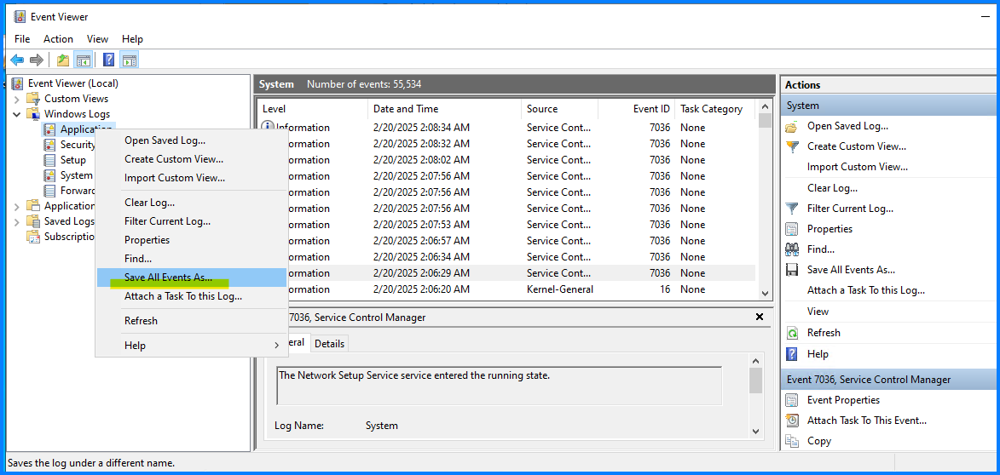

こんにちは！Azure Integration サポート チームの 山田 です。  

Azure Integration サポート チームでは Azure 製品以外にもオンプレミス製品を取り扱っております。
お客様環境のオンプレミス製品にて何らかの問題が発生した際に、本テクニカル サポートとしましてお客様にログの採取をお願いする場合がございます。

今回は Azure Integration サポート チーム にて MSMQ、Host Integration Server(HIS)、BizTalk Server などの調査時に取得いただきたいログの内容と、その取得方法についてご案内申し上げます。

<!-- more -->

## 目次
- イベント ログ
- MSMQ 関連ログ
- その他
- まとめ

## イベント ログ

イベント ログはイベント ビューアーより採取いただけます。

1. Windows Server 上にてイベント ビューアーを起動します（コマンド: eventvwr）
2. [Windows Logs (Windows ログ)] を展開します
3. 以下をそれぞれ右クリックし、[Save All Events As (すべてのイベントを名前をつけて保存)] を選択します  
- Application (アプリケーション)
- System (システム)
- Security (セキュリティ)
4. 任意の名前を入力し保存します。[Save as type (ファイルの種類)] は .evtx を選択します。

ここまでの手順により、イベント ログの内容がエクスポートされたイベント ファイルが作成されます。

なお、イベント ファイルを、イベントが記録された環境と異なる環境で開いた際には、イベント ビューアーでの表示に差異が生じる場合がございます。このため、続けて以下を実施いただけますと幸いです。

再度手順 3 以降について、今回は [Save as type (ファイルの種類)] にて、テキスト (タブ区切り) (.txt)、または CSV (コンマ区切り) (.csv) を選択します。

手順 4 で作成されるファイルの内容は、あくまでもイベント ログから一部項目を抜粋した内容となります。
しかしながら、前述したような表示の差異が生じず、イベントが記録された環境での表示情報を確認するのに役立つファイルとなります。

以上の手順で作成した、以下 2 点のファイルをご提供いただけますと幸いです。

- イベント ファイル
- テキスト ファイル、または CSV ファイル

他チームの記事にもイベント ログに関する参考情報がございます。

参考: [イベント ログの確認方法 | Microsoft Japan Windows Technology Support Blog](https://jpwinsup.github.io/blog/2023/09/25/UserInterfaceAndApps/EventLog/How-to-check-Event-log/)

参考: [IIS の調査に必要な基本的なログ情報について # イベント ログ](https://jpdsi.github.io/blog/web-apps/LogCollection1/#1-%E3%82%A4%E3%83%99%E3%83%B3%E3%83%88-%E3%83%AD%E3%82%B0)

[イベント ログを保存する方法1 - Host Integration Server | Microsoft Learn](https://learn.microsoft.com/ja-jp/host-integration-server/core/how-to-save-event-logs1)

## MSMQ 関連ログ

MSMQ の調査に有用な End2End ログの採取手順は以下記事をご覧いただけます。

[MSMQ で End2End ログを取得する手順 | Japan Azure Integration Support Blog](https://jpazinteg.github.io/blog/MSMQ/MsmqEnd2Endlog/)

その他 MSMQ 関連の情報を取得するコマンドを依頼する場合がございます。以下はメッセージ キューの情報を取得する PowerShell コマンドとなります。

[Get-MsmqQueue (MSMQ) | Microsoft Learn](https://learn.microsoft.com/ja-jp/powershell/module/msmq/get-msmqqueue?view=windowsserver2025-ps)

[Get-MSMQOutgoingQueue (MSMQ) | Microsoft Learn](https://learn.microsoft.com/ja-jp/powershell/module/msmq/get-msmqoutgoingqueue?view=windowsserver2025-ps)

ほか、[MSMQ の HTTP サポート](https://jpazinteg.github.io/blog/MSMQ/MsmqCleanInstall/#MSMQ-%E3%82%92%E3%83%89%E3%83%A1%E3%82%A4%E3%83%B3%E3%83%A2%E3%83%BC%E3%83%89%E3%81%A7%E3%82%A4%E3%83%B3%E3%82%B9%E3%83%88%E3%83%BC%E3%83%AB%E3%81%99%E3%82%8B%E6%89%8B%E9%A0%86%E3%81%AB%E3%81%A4%E3%81%84%E3%81%A6) をご利用の場合に、IIS 関連のログ取得をお願いする場合がございます。

参考: [IIS の調査に必要な基本的なログ情報について | Japan Developer Support Internet Team Blog](https://jpdsi.github.io/blog/web-apps/LogCollection1/) 

## その他

必要に応じて、各種コマンドの実行結果や、ネットワーク キャプチャを取得いただく場合がございます。その際のコマンドのご利用方法などについて、以下にリンクをおまとめいたしております。

### Systeminfo / Get-ComputerInfo など

[systeminfo | Microsoft Learn](https://learn.microsoft.com/ja-jp/windows-server/administration/windows-commands/systeminfo)

[Get-ComputerInfo (Microsoft.PowerShell.Management) - PowerShell | Microsoft Learn](https://learn.microsoft.com/ja-jp/powershell/module/microsoft.powershell.management/get-computerinfo)

### nslookup / Resolve-DnsName など

[nslookup | Microsoft Learn](https://learn.microsoft.com/ja-jp/windows-server/administration/windows-commands/nslookup)

[Resolve-DnsName (DnsClient) | Microsoft Learn](https://learn.microsoft.com/ja-jp/powershell/module/dnsclient/resolve-dnsname)

[DNS クライアントの名前解決に関する問題のトラブルシューティング - Windows Client | Microsoft Learn](https://learn.microsoft.com/ja-jp/troubleshoot/windows-client/networking/troubleshoot-dns-client-resolution-issues)

### ping / tracert / Test-NetConnection など

[ping | Microsoft Learn](https://learn.microsoft.com/ja-jp/windows-server/administration/windows-commands/ping)

[tracert | Microsoft Learn](https://learn.microsoft.com/ja-jp/windows-server/administration/windows-commands/tracert)

[Test-NetConnection (NetTCPIP) | Microsoft Learn](https://learn.microsoft.com/ja-jp/powershell/module/nettcpip/test-netconnection)

### netstat / Get-NetTCPConnection など

[netstat | Microsoft Learn](https://learn.microsoft.com/ja-jp/windows-server/administration/windows-commands/netstat)

[Get-NetTCPConnection (NetTCPIP) | Microsoft Learn](https://learn.microsoft.com/ja-jp/powershell/module/nettcpip/get-nettcpconnection)

[TCP/IP ポート不足のトラブルシューティング - Windows Client | Microsoft Learn](https://learn.microsoft.com/ja-jp/troubleshoot/windows-client/networking/tcp-ip-port-exhaustion-troubleshooting)

### ipconfig / Get-NetIPConfiguration など

[ipconfig | Microsoft Learn](https://learn.microsoft.com/ja-jp/windows-server/administration/windows-commands/ipconfig)

[Get-NetIPConfiguration (NetTCPIP) | Microsoft Learn](https://learn.microsoft.com/ja-jp/powershell/module/nettcpip/get-netipconfiguration)

### パケット キャプチャーなど

ネットワークの問題が疑われる場合に、Wireshark 等に代表されるネットワーク診断ツールからのログ取得をお願いする場合がございます。

[ネットワークに関する問題のトラブルシューティング](https://learn.microsoft.com/ja-jp/azure/developer/java/sdk/troubleshooting-network?tabs=windows)

[How to Capture Simultaneous Wireshark Traces from Client and Server for Network Troubleshooting](https://techcommunity.microsoft.com/blog/iis-support-blog/capture-a-network-trace--wireshark/4245529)

取得いただきましたログは一連、弊社サポート エンジニアより連携させていただきますファイル アップロード サイトにアップロード頂ければ幸いです。

## まとめ

以上本記事では、オンプレミス製品の調査時にサポートよりお願い差し上げるログについてご案内いたしました。調査をご依頼の際はこちらの内容を基に本テクニカル サポートへお問合せいただければ幸いです。

- イベント ログ
- MSMQ 関連ログ
- その他

最後までお読みいただき、ありがとうございました！